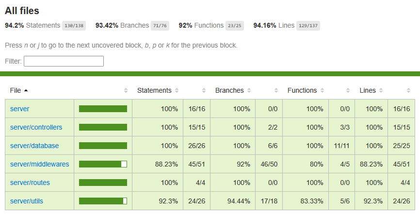

# TESTAUS

Sovellusta on testattu Jestillä. Testit voi ajaa komennolla `npm run test` ja testauskattavuusraportin voi generoida komennolla `npm run test:cov`.

## Yksikkötestaus

Yksikkötestit kattavat kaikki sovelluksen keskeiset toiminnot ja liiketoimintasäännöt:

- **Perustoiminnot:** Varausten luominen, listaaminen ja poistaminen.
- **Aikarajoitukset:** Aukioloajat, 15 minuutin intervallisääntö ja varauksen kesto (15min - 8h).
- **Päällekkäisyydet:** Saman huoneen päällekkäisten varausten estäminen.
- **Validointi:** Virheelliset aikamuodot, puuttuvat tiedot ja merkkijonojen pituusrajoitukset.

## Testauskattavuus

Rivikattavuus on 94.16% ja haarautumakattavuus 93.42%.

